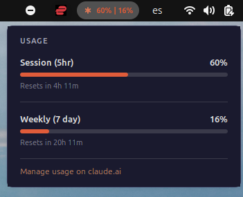
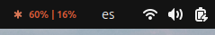

# Claude Usage Stats

A lightweight system bar overlay that shows your **Claude AI session and weekly usage** in real time — for Ubuntu, macOS, and Windows. You can also click on the "Manage usage on claude.ai"

Inspired by the usage panel in the Claude Code VS Code extension.

---

## Preview





The popup / dropdown shows:

```
USAGE
─────────────────────────────────────
Session (5hr)                      50%
████████████░░░░░░░░░░░░░░░░░░░░
Resets in 3h 0m

─────────────────────────────────────
Weekly (7 day)                      5%
██░░░░░░░░░░░░░░░░░░░░░░░░░░░░░░
Resets in 1d 6h

─────────────────────────────────────
Manage usage on claude.ai
```

---

## How it works

1. Reads your **OAuth access token** from `~/.claude/.credentials.json`  
   (created automatically by the Claude Code CLI when you log in)
2. Calls `https://claude.ai/api/oauth/usage` — the same private endpoint used by the VS Code extension
3. Displays the returned `five_hour` (session) and `seven_day` (weekly) utilisation percentages

**Your token never leaves your machine.** The only outbound request is to `claude.ai` (Anthropic's own servers).

---


## Prerequisites (all platforms)

- **Claude Code CLI** installed and logged in  
  → [https://claude.ai/code](https://claude.ai/code)  
  After install, run `claude` once to authenticate. This creates `~/.claude/.credentials.json`.

- **Python 3.8+**  
  Check: `python3 --version` (Linux/macOS) or `python --version` (Windows)

---

## Installation

### Ubuntu / GNOME

**Requirements:** Ubuntu 22.04+ · GNOME Shell 45+

```bash
git clone https://github.com/quentin-hoa/Claude_usage_extension.git
cd Claude_usage_extension_Ubuntu
bash ubuntu/install.sh
```

The script checks for GNOME Shell, verifies Claude credentials, and installs the extension files. Then reload GNOME Shell:

- **X11:** Press `Alt + F2`, type `r`, press `Enter`
- **Wayland:** Log out and log back in

Enable the extension:

```bash
gnome-extensions enable claude-usage-stats@community
```

The `◆ 50% | 5%` indicator appears in the top-right panel. Click to open the usage popup.

---

### macOS (via xbar)

**Requirements:** macOS 11+ · [xbar](https://xbarapp.com/)

```bash
# 1. Install xbar
brew install --cask xbar

# 2. Open xbar once — this creates the plugins folder
open /Applications/xbar.app

# 3. Clone and install
git clone https://github.com/quentin-hoa/Claude_usage_extension_Ubuntu.git
cd Claude_usage_extension_Ubuntu
bash macos/install.sh
```

Refresh: click any menu bar item → **Refresh All**.

The `◆ 50% · 5%` indicator appears in your macOS menu bar.  
*(Note: `·` separator — xbar reserves `|` for its own attribute syntax.)*

---

### Windows (system tray)

**Requirements:** Windows 10/11 · Python 3.8+ from [python.org](https://python.org) *(not the Windows Store version)*

```batch
git clone https://github.com/quentin-hoa/Claude_usage_extension_Ubuntu.git
cd Claude_usage_extension_Ubuntu
windows\install.bat
```

The install script:
1. Installs `pystray` and `Pillow` via pip
2. Copies `fetch_usage.py` to `%USERPROFILE%\.local\share\claude-usage-stats\`
3. Creates a startup `.vbs` shortcut so the tray icon launches automatically on login

To start immediately without rebooting:

```batch
pythonw windows\claude_usage_tray.py
```

Right-click the tray icon to see usage stats.

> **Note:** Keep the cloned repo folder in place — the startup shortcut points to it.  
> Credentials are read from `%USERPROFILE%\.claude\.credentials.json`.

---

## Uninstall

### Ubuntu
```bash
gnome-extensions disable claude-usage-stats@community
rm -rf ~/.local/share/gnome-shell/extensions/claude-usage-stats@community
rm -f ~/.local/bin/claude-usage-stats.sh
rm -rf ~/.local/share/claude-usage-stats
```

### macOS
```bash
# xbar
rm "$HOME/Library/Application Support/xbar/plugins/claude-usage.1m.sh"
# SwiftBar
rm "$HOME/Library/Application Support/SwiftBar/Plugins/claude-usage.1m.sh"

rm -rf ~/.local/share/claude-usage-stats
```

### Windows
1. Delete `%APPDATA%\Microsoft\Windows\Start Menu\Programs\Startup\claude-usage-tray.vbs`
2. Optionally: `pip uninstall pystray Pillow`
3. Delete the cloned repo folder

---

## Configuration

| File | What to change | Default |
|------|---------------|---------|
| `ubuntu/extension/extension.js` | `REFRESH_SECONDS` | `60` |
| `macos/claude-usage.1m.sh` | rename file (`1m` → `30s`, `5m`, etc.) | 1 minute |
| `windows/claude_usage_tray.py` | `REFRESH_SECONDS` | `60` |

For macOS, xbar/SwiftBar use the filename to set the refresh interval:  
`claude-usage.30s.sh` → every 30 s · `claude-usage.5m.sh` → every 5 min

---

## Troubleshooting

**"Credentials not found"**  
→ Run `claude` in your terminal and complete the login flow.  
The file `~/.claude/.credentials.json` (or `%USERPROFILE%\.claude\.credentials.json` on Windows) must exist.

**Extension doesn't appear (Ubuntu)**  
→ Reload GNOME Shell first, then run `gnome-extensions enable claude-usage-stats@community`.

**Error / nothing displays**  
→ Test the fetch script directly from the repo root:
```bash
python3 shared/fetch_usage.py
# Expected: {"session_pct": 50, "weekly_pct": 5, "session_resets_in": "3h 0m", ...}
```
If it errors, your token may be expired — re-run `claude` once to refresh it.

**Token expired**  
→ Open any `claude` CLI session. It auto-refreshes the token.

---

## File structure

```
Claude_usage_extension_Ubuntu/
├── shared/
│   └── fetch_usage.py          # Core API fetch — used by all 3 platforms, zero deps
├── ubuntu/
│   ├── extension/
│   │   ├── extension.js        # GNOME Shell 45/46 extension
│   │   ├── metadata.json
│   │   ├── stylesheet.css
│   │   └── claude-logo.svg
│   ├── claude-usage-stats.sh   # Thin wrapper (replaced by install.sh with absolute path)
│   └── install.sh
├── macos/
│   ├── claude-usage.1m.sh      # xbar / SwiftBar plugin
│   └── install.sh
├── windows/
│   ├── claude_usage_tray.py    # Python system tray app
│   ├── requirements.txt
│   └── install.bat
├── .gitignore
└── README.md
```

---

## Contributing

Quentin HOARAU
